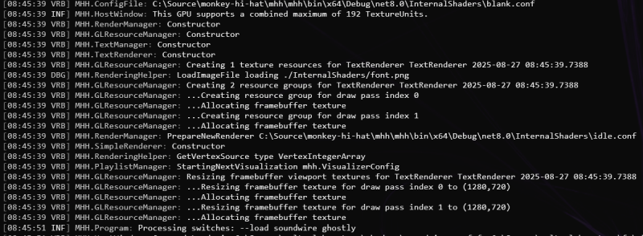

# Logging

## How It Works

When technical troubleshooting becomes necessary, Monkey Hi Hat features fairly extensive and robust logging capabilities. By default, a log file called `mhh.log` is generated in the application's install directory, although this can be changed in the configuration file. The initial log file is named `mhh.log` and over time additional files like `mhh_001.log` and `mhh_002.log` may be seen. The system limits each log file to 5MB, it will never store more than 10 log files, and it doesn't keep log files more than 7 days. Cleanup is automatic when you run the program or new log output occurs. The program uses industry-standard "log levels" to control the amount of detail provided. By default, only warnings or errors are logged, but much greater detail is available when necessary. There is also an option to show log output in the program console window, so you can see the activity as it occurs. Finally, some of the libraries used by the program also contribute to logging.

Generally a user will not need to care much about logging. It is most useful for app development or troubleshooting specific issues. If you are having a problem with the program, open an issue, and feel free to attach the log file. It may be useful to _temporarily_ "turn up" the logging to a more verbose level of detail, but you do not want to run the program long-term this way, as the log file can get quite large.

## Configuration

Several settings in `mhh.conf` control logging. The location of the log file is the `LogPath` setting in the `[windows]` or `[linux]` section. If it is blank the log is written to the application directory.

The level is controlled by the `LogLevel` setting and is `Warning` by default. Any value from the Levels section below can be used.

Which categories actually produce log entries is controlled by the `LogCategories` setting. This is a comma-separated list. The default is to show Monkey Hi Hat errors as well as OpenGL errors logged by _Eyecandy_ so the default setting is `LogCategories=MHH, Eyecandy.OpenGL`. Even though Monkey Hi Hat also contains a lot of OpenGL code, the OpenGL error-logging facility is "wired up" inside _Eyecandy_ before MHH is even initialized.

Because the filter tests the beginning of category names, partial matches work. For example, to troubleshoot the audio capture capabilities of the _Eyecandy_ library, you could specify `LogCategories=Eyecandy.AudioCapture` and you'd see output from all of these related features:

* Eyecandy
  * AudioCaptureBase
  * AudioCaptureOpenALSoft
  * AudioCaptureSyntheticData
  * AudioCaptureWASAPI

Other _Eyecandy_ output such as `EyeCandy.AudioTexture` would remain suppressed. All of the available categories are listed below.

Because OpenGL errors often happen on every frame (ie. 60 times per second) the log file can quickly become gigantic when there is a problem. To address this, _Eyecandy_ is able to throttle repeated errors to keep the logs manageable (and readable). Upon program exit, it will also dump a total count of each throttled error.

`OpenGLErrorThrottle` is a time in milliseconds which defaults to 60000 (one minute). The same OpenGL error will not be output to the log more than this time period.

`OpenGLErrorBreakpoint` defaults to false. This is a developer setting. If this is true and a debugger is attached, a break is triggered if the OpenGL error callback is invoked.

## Log Levels

In programming terminology, there are standard "log levels" that filter how much detail is stored. By default, Monkey Hi Hat is configured for `Warning` or "higher", which means `Error` and `Critical` are also logged. MHH uses the Microsoft standard terms, but slightly different terms are used by another logging system (Serilog). Console output is prefixed by a three-letter indicator such as `DBG` for debug-level messages.

The levels are, in order of most-detailed to least-detailed:

| Log Level | Console Prefix |
|---|---|
| `Trace` | `VRB` _aka verbose_ |
| `Debug` | `DBG` |
| `Information` | `INF` |
| `Warning` | `WRN` |
| `Error` | `ERR` |
| `Critical` | `FTL` _aka fatal_ |
| `None` | _suppress all logging_ |

Just a few seconds of start-up verbose logging looks something like this:

## OpenGL Log Levels

The OpenGL libraries have their own list of custom log levels. High-detail OpenGL logging may impact performance (very driver-specific). The available levels are:

| Log Level | Description of detail |
|---|---|
| `Normal` | Default; some errors and content suppressed |
| `DebugContext` | Maximum detail, performance impact likely |
| `LowDetail` | Normal, single-line output, no execution detail |
| `Disabled` | Blocks all OpenGL error logging |

## Log Categories

A log "category" identifies where a logged message comes from. Monkey Hi Hat outputs to many categories, as do a couple of the other libraries it uses. Log data can be "requested" by category. This helps you or a developer focus on areas of interest without distracting noise from other parts of the system. For example, the _Eyecandy_ library that turns audio into data can be extremely noisy, so it is almost completely suppressed by default. The categories are also somewhat hierarchical. The _CommandLineSwitchPipe_ library is very simple, so it has a single category. But _Eyecandy_ has many, such as `Eyecandy.Shader` and `Eyecandy.OpenGL`. The following is a list of all currently-available log categories:

* CommandLineSwitchPipe
* Eyecandy
  * AudioCaptureBase
  * AudioCaptureOpenALSoft
  * AudioCaptureSyntheticData
  * AudioCaptureWASAPI
  * AudioTextureEngine
  * AudioTexture
  * BaseWindow
  * OpenAL
  * OpenGL
  * Shader
  * ShaderLibrary
* MHH
  * ConfigFile
  * HostWindow
  * PlaylistConfig
  * PlaylistManager
  * VisualizerConfig
  * Program
  * CrossfadeRenderer
  * FXRenderer
  * MultipassRenderer
  * MultipassSectionParser
  * RenderManager
  * ScreenshotWriter
  * SimpleRenderer
  * TextManager
  * TextRenderer
  * VideoMediaProcessor
  * CacheLRU
  * IOSInterop
  * RenderingHelper
  * GLResourceManager
  * VertexIntegerArray
  * VertexQuad

Some of these output very little, such as "Constructor" when they're created, but not much more (especially if they're very high-performance, such as part of rendering that can happen thousands of times per second). Others are very noisy, such as the `Eyecandy.Shader` category, which is constantly busy in a program such as this. Finally, particularly at Trace and Debug levels of output, some may appear random, based on logging that was needed to troubleshoot a specific issue.

