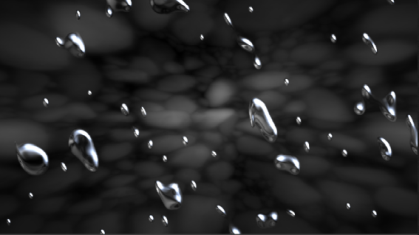
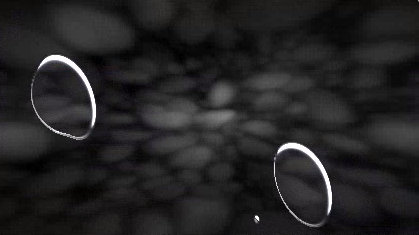

# Shader Basics

## Shader Tutorials

Writing OpenGL shaders is a very complex topic. The language (GLSL) is unique, the massively-parallel GPU processing model has many important differences compared to traditional programming, and there is almost an endless list of tricks and techniques that are in use. This section doesn't try to teach shader programming. This is only about details that are specific to monkey-hi-hat shaders. 

If you aren't sure where to begin, I strongly recommend Gregg Man's VertexShaderArt [tutorial](https://www.youtube.com/@vertexshaderart8178/videos) videos for a nice introduction to some of the basics of shader programming. It's specific to the unique integer-input approach used by `VertexIntegerArray` shaders, but a lot of the math techniques and other considerations are broadly applicable.

For fragment-oriented shaders like those found on Shadertoy, you may want to read some of the introductory chapters of Nathan Vaughn's [tutorial](https://inspirnathan.com/posts/47-shadertoy-tutorial-part-1/). (It can be difficult to learn from Shadertoy content; commenting is often poor or non-existent, and some programmers enjoy the challenge of writing the smallest possible code -- what they call _golfing_ -- which can make the code nearly impossible to decipher. Unfortunate since the original source code has little correlation to compiled memory consumption.)

## OpenGL Version and Precision Directives

As of version 3.0, monkey-hi-hat only supports OpenGL 4.5. This is close to the final OpenGL 4.6 API level since Khronos (who defines the standards) decided to start over with the "new" (years old...) Vulkan API. Each vert and frag shader should begin with a version directive, which _must_ be the first line of the shader other than blanks or comments:

```GLSL
#version 450
```

Additionally, fragment shaders should define high-precision floating-point values (vertex shaders don't need this and it has no effect on them):

```GLSL
#version 450
precision highp float;
```

## Inputs, Uniforms, and Outputs

There are a number of pre-defined inputs and uniforms provided by monkey-hi-hat, and some conventions about outputs. Of course, if you are defining both the vertex and fragment shaders, you can use whatever outputs you like for passing data from the vertex stage to the fragment stage.

## Uniforms

Every monkey-hi-hat vertex and fragment shader has access to these uniforms:

| Type | Name | Description |
|---|---|---|
| `float` | `time`         | number of seconds elapsed since the shader started running               |
| `float` | `frame`        | frame count float for the current visualizer (0-based)                   |
| `vec2` | `resolution`    | width and height of the display area in pixels                           |
| `vec4` | `date`          | year, month, date, and seconds since midnight (like Shadertoy `iDate`)   |
| `vec4` | `clocktime`     | hour (local timezone), minute, seconds, and the UTC hour (no timezone)   |
| `float` | `randomseed`   | a normalized float (0-1) randomly generated at program startup           |
| `float` | `randomrun`    | a normalized float (0-1) randomly generated at visualization startup     |
| `vec4` | `randomrun4`    | four normalized floats (0-1) randomly generated at visualization startup |
| `float` | `randomnumber` | a normalized float (0-1) randomly generated for each new frame           |
| `float` | `fxactive`     | a 0/1 flag indicating whether a post-processing FX is running (v4.2.0)   |
| `float` | `silence`      |  a 0/1 flag indicating whether the engine detected silence (v4.4.0)      |

Of course, you are also free to defined fixed-value and random-value inputs (see _Visualization Configuration_ and _Post-Processing FX_ for more information).

## VertexIntegerArray Inputs

When the Vertex Source Type is `VertexIntegerArray` these inputs are available:
* `uniform float vertexCount` is the total number of integers that will be passed to the shader
* `layout in float vertexId` is the current number being processed (zero to `vertexCount` minus one)

Even though the Vertex Source Type works with integers, they are passed as `float` to facilitate the sort of math which usually takes place in a shader. If you need them as integers, you can simply declare conversion macros at the start of the shader:

```GLSL
#define iVerexCount int(vertexCount)
#define iVertexId int(vertexId)
```

## Vertex Shader Outputs

* `out vec4 v_color` is the vertex color typically used here by convention
* `gl_Position` is the built-in `vec4` output for the calculated vertex position
* `gl_PointSize` is the built-in `float` output used in `Point` array-drawing mode

## Fragment Shader Inputs

* `in vec4 v_color` is the vertex output color typically used here by convention
* `in vec2 fragCoord` is the normalized (x,y) coordinate being processed by the shader

## Fragment Shader Outputs

* `out vec4 fragColor` is the fragment output color typically used here by convention

> The output color's alpha channel (`fragColor.a`) should _always_ be 1.0 for _all_ shader types (viz, FX, crossfade, etc). For multipass shaders, this only matters in the final output pass. Monkey Hi Hat doesn't care about it, but some external applications receiving visualizer frames over Spout or NDI may output a blank screen. (It's particularly common for Shadertoy programs to leave alpha at zero since it doesn't matter in Shadertoy, either.)

## VertexShaderArt Conversions

The VertexShaderArt `mouse` and `touch` inputs are rarely used, but given that monkey-hi-hat isn't interactive that way, they can be set to a `#define` constant. I haven't seen the `soundRes` or `background` audio textures used anywhere, so these could also be set to a constant if you encounter them.

Audio Textures in VertexShaderArt have data in the alpha `a` channel. In monkey-hi-hat, you will need to change this to reference the green `g` channel. VertexShaderArt audio data is stored as 16-bit integers (except their `floatSound` texture, which is rarely used), whereas eyecandy provides 32-bit RGBA `float` values. Most likely the `eyecandyWebAudio` sound texture is most similar to the VertexShaderArt `sound` texture.

Finally, look for `#define` settings and constants which can be converted to fixed- or random-value settings with the visualizer `[uniforms]` section. These will add variety to the visualizations which is not readily available in the originals.

## Basic Shadertoy Conversions

Shadertoy uses a `void mainImage(in vec2 fragCoord, out vec4 fragColor)` function signature. For monkey-hi-hat, simply convert this to `void main()`. Be aware that Shadertoy sets these in/out arguments positionally; occasionally you'll find Shadertoy programs where the user changed the _names_ of the input and output arguments, such as `void mainImage(in vec2 u, out vec4 c)`.

Audio Textures in Shadertoy have data in the red `r` channel (also frequently referenced as the `x` component; same thing). In monkey-hi-hat, you will need to change this to reference the green `g` channel. Shadertoy audio data is stored as 16-bit integers, whereas eyecandy uses 32-bit RGBA `float` values, but since they're normalized to floats, this isn't normally important.

The fragment shader template shows a number of useful `#define` declarations which remap monkey-hi-hat inputs to Shadertoy names:

```GLSL
#define fragCoord (fragCoord * resolution)
#define iTime time
#define iFrame frame
#define iResolution resolution
#define iChannel0 eyecandyShadertoy
#define iMouse vec2(resolution.xy / 2.0)
```

The `fragCoord` macro is useful because Shadertoy supplies the physical (x,y) pixel coordinates rather than normalized (0.0 to 1.0) values.

The `iChannel0` replacement assumes the original Shadertoy code was reading audio data from the first channel slot in the Shadertoy UI. For more complex conversions, you can also define macros to map other `iChannel` references to buffer inputs, texture files, and so on.

Since monkey-hi-hat doesn't have mouse support, setting `iMouse` to any constant seems to work for most shaders -- typically they respond to changes in the mouse position. In Shadertoy, the mouse x,y coordinates map to the resolution (they aren't normalized values).

There are a few Shadertoy uniforms which have no corresponding monkey-hi-hat equivalent. For example, `iChannelTime` refers to either the amount of time an input video or a Soundcloud track has been playing. Typically I will just use the `time` uniform instead, although for videos `_duration` and `_progress` uniforms are available prefixed by the texture sampler uniform name.

Finally, just as we advise for VertexShaderArt conversions, look for `#define` settings and constants which can be converted to fixed- or random-value settings with the visualizer `[uniforms]` section. These will add variety to the visualizations which is not readily available in the originals.

## Shadertoy Multi-Pass Conversions

Shadertoy has a multi-pass concept which is similar to the monkey-hi-hat multi-pass feature, although the monkey-hi-hat approach is more flexible.

In Shadertoy, you have up to four tabs for source code labeled `BufferA` through `BufferD`, as well as an `Image` tab which is the final output pass in a multi-pass program. Each buffer is a rendering pass, and each pass has four input channels labeled `iChannel0` through `iChannel3`. These can be pointed at the pass buffers, audio data, or static resources like texture image files.

In a Shadertoy multi-pass program, often the `Image` tab simply copies one of the buffers as output. When you see this, you can ignore the code in that tab. In monkey-hi-hat, the draw-buffer of the final pass is always used as output automatically.

For Shadertoy, buffer data is updated sequentially. If `BufferA` uses its own previous-frame data as input (by pointing `iChannel0` at `BufferA`, for example), after the code in `BufferA` runs, any later passes will only see the modified output of `BufferA` from that same frame. If `BufferB` _also_ points `iChannel0` at `BufferA`, it won't get the previous frame's `BufferA` data, it will get whatever the `BufferA` code generated on that same frame.

On the other hand, in monkey-hi-hat, _both_ the previous-frame and current-frame data is available for each pass for the entire duration of the frame. This means you have to consider how the Shadertoy program is using that input data. Technically when `BufferA` and `BufferB` both reference `BufferA` data, the monkey-hi-hat equivalent should pass the previous-frame data (letter-based, like `inputA`) to the shader code matching `BufferA`, but pass the current-frame data (number-based, like `input0`) to the shader code matching `BufferB`. It's less complicated than it sounds after you get used to it.

Additionally, monkey-hi-hat can modify any draw-buffer at any time. It is often more efficient to "stack" effects by using two alternating buffers rather than using a whole series of separate buffers, as is required by Shadertoy's more limited approach.

## Using Shadertoy Programs as FX

Many Shadertoy programs that use a static image texture as input are candidates for conversion to a monkey-hi-hat FX shader. A good example is the [staircase FX](https://github.com/MV10/volts-laboratory/blob/master/fx/staircase.conf) in Volt's Laboratory. The original Shadertoy program, [Cellular Blocks](https://www.shadertoy.com/view/ltySRt) by the genius shader author named Shane, is one such example. The original uses the rusty metal texture as `iChannel0`, but in monkey-hi-hat, that input is replaced by the output of another shader -- _any_ other shader. The results are pretty interesting, to say the least.

Keep this approach in mind as you look for ideas for new FX shaders.

## GPUs Are Not Identical

The _Introduction_ page mentions I don't intend to support Intel's integrated GPUs, but even AMD and NVIDIA have their hardware and driver quirks. 

### Pseudo-Random Number Generators

An easy-to-see example is exhibited by zguerrero's Shadertoy creation [SlowMo Fluid](https://www.shadertoy.com/view/ltdGDn), which is the basis for the _splash_ FX used by monkey-hi-hat. The following screenshots are from Shadertoy in the browser, but the monkey-hi-hat FX exhibits the exact same behavior.

> UPDATE 2025-AUG-13: Shadertoy user morimea (aka danilw on Github) pointed out this isn't actually an AMD bug and many NVIDIA GPUs exhibit the same behavior. It is the sin-hash function itself which is unreliable, as noted on his Github [README](https://github.com/danilw/GPU-sin-hash-stability), and documented further in his Medium [article](https://arugl.medium.com/hash-noise-in-gpu-shaders-210188ac3a3e). The rest of this section is as I wrote it originally in 2023, and two years later people are still using the broken hash, so it's worth being aware of.

This is how it looks on my primary desktop with a dedicated NVIDIA RTX-2060 GPU:



But when I run it on the living room TV's miniPC, which uses an integrated AMD Radeon 780M, it only ever generates two big, uninteresting bubbles (and another user on Shadertoy reported his Mac M1 GPU produces the same incorrect results):



Bear in mind that Shadertoy can't generate random numbers, so they _should_ be identical. Why does this happen? I suspect a roundoff or similar numeric issue with this function, which is a standard way of generating a pseudo-random number (it isn't actually random in any sense, it's just "large and unexpected" -- but always the same):

```glsl
float hash(float n)
{
   return fract(sin(dot(vec2(n,n) ,vec2(12.9898,78.233))) * 43758.5453);  
}  
```

For what it's worth, this exact calculation (and the occasional minor variation, like `vec2(n, -n)`) shows up in [many](https://gist.github.com/PossiblyAShrub/42f446bc2956c3d1800da7f5e111086e#file-donut-txt-L26) other [places](https://jaksa.wordpress.com/2014/09/02/writing-a-parallel-sort-on-glsl-heroku-com/) all across the web, it isn't something specific to Shadertoy. In fact, it is also in other Monkey Hi Hat FX and visualizations where it _does_ work properly. I spent a lot of time searching and I have no idea where it came from originally. (It seems to be related to the [xorshift](https://en.wikipedia.org/wiki/Xorshift) algorithm and its variants, but not exactly the same.)

The fix, incidentally, was to reference a noise-texture rather than the calculation. Then both NVIDIA and AMD GPUs showed the same behaviors.

### Other References

The Shadertoy user FabriceNeyret2 has some older articles on his [Shadertoy Unofficial](https://shadertoyunofficial.wordpress.com/) blog that are worth reading. In particular, he describes a lot of bugs and compatibility issues that sound similar to the _SlowMo Fluid_ example above in his 2016 article [Compatibility Issues in Shadertoy WebGLSL](https://shadertoyunofficial.wordpress.com/2016/07/22/compatibility-issues-in-shadertoy-webglsl/) (and obviously I think they probably apply outside the context of WebGL).

Github user danilw also maintains a very large and detailed list of [GPU bugs](https://github.com/danilw/GPU-my-list-of-bugs), including this specific hash function problem (which is really a problem with the `sin` implementation).

