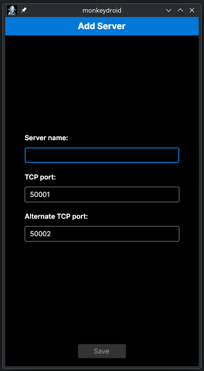
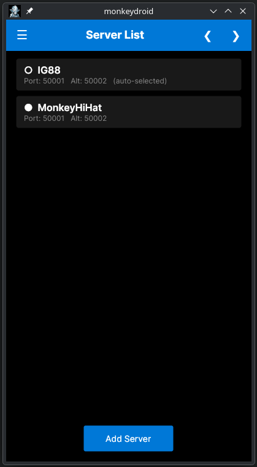
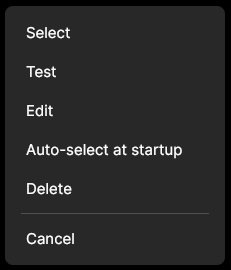
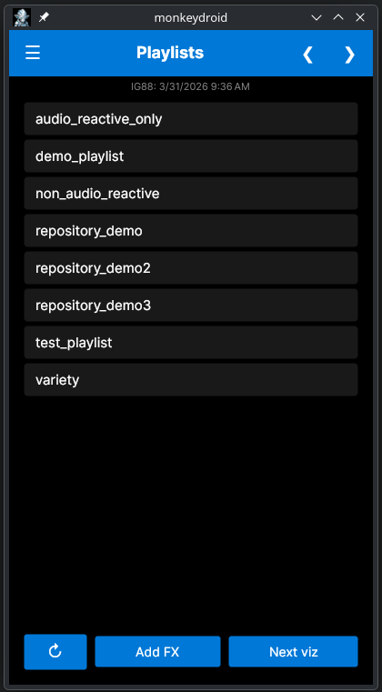
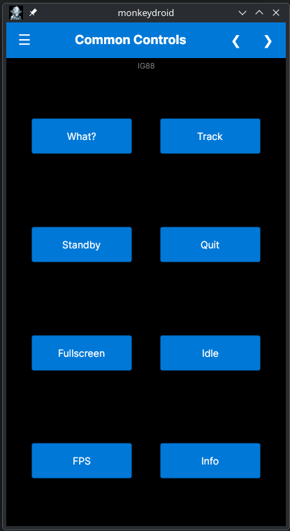
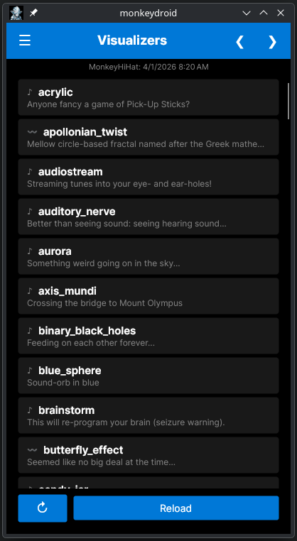
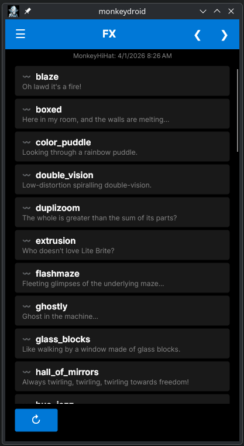
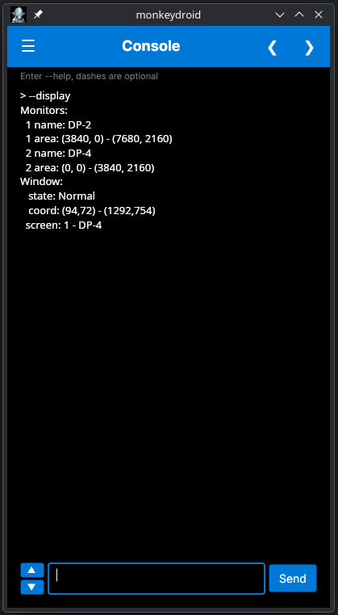
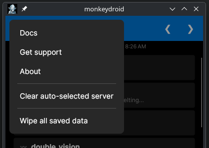

# Using Monkey Droid

As you have no doubt noticed, I frequently recommend the dedicated remote control GUI application, Monkey Droid. The Monkey Hi Hat visualizer was never intended to be an interactive program. You set it up, run it, and enjoy. The design is that it takes over the entire display. So control is external, normally from another device, although it could be a secondary monitor on the same device. The screenshots in this section are from the Linux version, but the Windows and Android versions are identical except for minor window-frame details (close button, etc).

Typing remote commands (most likely over SSH) was the original game plan, but that was a bit of a hassle sitting on the couch watching it on the big TV in the living room. These days a mobile phone is always within reach, so that was the ideal solution. Unfortunately Apple insists on having a Mac to build anything for iOS and I have zero interest in ever owning Apple products, so at the moment only Android is supported -- or a Windows or Linux device like a tablet.

Monkey Droid communicates over the local network (only) to a computer running Monkey Hi Hat. You must know the computer name. Network communication involves something called TCP ports. If you don't know or care what that means, don't worry, Monkey Hi Hat's default setup normally always works. (If you have problems, open an Issue and ask for help.) Windows installs of Monkey Hi Hat can optionally use a service called monkey-see-monkey-do (MSMD), which listens on an extra port. If Monkey Hi Hat isn't running and you send a command from Monkey Droid, this alternate port is used to "wake up" Monkey Hi Hat. Currently this isn't possible on Linux, it's on my to-do list to figure out.

## Installation

> If you're using Monkey Droid v1 prior to April 2026, you must manually remove / uninstall.

Although version 2 doesn't require installation, each OS may require some manual steps after downloading the file from the [release](https://github.com/MV10/monkey-hi-hat/releases/) page.

* Windows may show you a warning when you run the program because it was downloaded from the Internet. The exact message varies based on the Windows version and which updates have been installed. You can choose to allow it every time, but it's usually better to clear that flag. Right-click the exe, choose _Properties_, and you should see an `Unblock` button at the bottom.

* Android requires "side-loading" the APK install package (which just means you didn't download it from the Google Play Store). Different manufacturers handle this in different ways, but typically it will ask you about scanning the file. You can do that if you want, but some versions will try to block it because it isn't found on the Play Store. Under the various options you will find something that lets you install it anyway -- choose that. Unfortunately I can't be any more specific than that, there are too many variations out there. I'm sure a Google search will help if you have problems. If you can't figure it out, open an Issue and ask (but no guarantees).

* On Linux, you have to make the program executable. Change to the directory where you saved the file and run `chmod +x monkeydroid`. You should be able to launch it after that.

## Running for the First Time

The first time you launch Monkey Droid, it will take you straight to the _Server Editor_ screen. All you really need to enter here is the name of the computer running Monkey Hi Hat, then click `Save`. It will tell you that this server will be auto-selected when Monkey Droid starts (you can change that later, or clear it). (As explained above, you can also modify the TCP port numbers, but this is usually unnecessary. Changing these also requires changing the Monkey Hi Hat configuration file to match.) 

After you save the server name, it takes you straight to the _Playlists_ screen. Assuming Monkey Hi Hat is actually running, hit the refresh (<kbd>&olarr;</kbd>) button at the bottom left. That will load all of the playlist files visible to the server. From there you can select any playlist and it will immediately start running. This screen also has `Next viz` and `Add FX` buttons since those are the two things people usually want to do from a playlist. (Note that you can only request an FX if the visualizer isn't already running one.)

### Other Startup Behaviors

If you don't have any server data yet, the program will always start at the _Server Editor_ screen, as explained above. Otherwise, if a server is marked for auto-select, as you'd expect that server becomes active and you begin at the _Playlist_ screen, also as explained above. If no server is marked for auto-select, the program will start at the _Server List_ screen instead. As you might expect, this is where you tell Monkey Droid which server to control. Other navigation is disabled until a server is selected. 

## Program Screens

Once a server is selected, you can navigate through the screens with the arrow (<kbd>&lt;</kbd> <kbd>&gt;</kbd>) buttons. You can see those buttons in the titlebar in the screenshots that follow. Android users can also swipe left or right on the titlebar. Navigation is wrap-around from the _Server List_ and _Console_ screens. 

The sequence below may seem a little unusual, but it's based upon years of frequent use. Most commonly you will work from the _Playlists_ screen with one server. Even as a developer, it's rare to remotely run a single specific visualization or FX, or type a console command. The sequence is:

* _Server List_
* _Playlists_
* _Common Controls_
* _Visualizers_
* _FX_
* _Console_

### _Server List_

This screen lets you work with different computers running Monkey Hi Hat.

In the screenshot below, the server named MonkeyHiHat is selected (indicated by the solid dot next to the server name), although the server named IG88 is configured for auto-select (notice the text to the right of the port numbers below the server name). Clicking the `Add` button takes you to the _Server Editor_ screen shown above in _Running for the First Time_.

If you click or tap on a server, a menu opens with several options which are mostly self-explanatory. The _Test_ option simply tries to connect to the server. Note that if the chosen server is already designated for auto-select at startup, you will see an option to disable that instead. In addition to _Cancel_ you can tap or click anywhere outside the menu to dismiss it. 

### _Playlists_

This screen lets you start different playlists or perform a few actions when a playlist is running.

As explained earlier, the refresh <kbd>&olarr;</kbd>) button at the bottom left will load a list of all the playlist files the server knows about. The screenshot below shows the defaults that install with Monkey Hi Hat. The small text below the titlebar shows the selected server name and a timestamp when the list was retrieved.

When a playlist is active, the `Next viz` button will change to a new visualization (which one depends on playlist settings -- randomized, sequential, etc.). When a playlist visualizer is running, the `Add FX` will start a post-processing effect if an FX isn't already running.

### _Common Controls_

This screen lets you issue a few commonly-used commands without having to type them or remember the keyboard command (assuming you have a remote keyboard attached to the Monkey Hi Hat computer).

* _What?_ shows the names and descriptions of the visualizer and any FX (people often ask, "What is this?")
* _Track_ shows details about the music being played, if available (varies by OS and music sources)
* _Standby_ puts Monkey Hi Hat into standby mode
* _Quit_ ends the Monkey Hi Hat program (even if configured for standby)
* _Fullscreen_ toggles between windowed and fullscreen mode
* _Idle_ ends any playlist or visualizer and returns to the basic start-up Idle spinny-ball visualizer
* _FPS_ shows some Frames Per Second performance info in a Monkey Droid pop-up
* _Info_ shows some details about what is on-screen in a Monkey Droid pop-up

### _Visualizers_

This screen lets you launch specific visualizers. If a playlist is running, the playlist will end.

Like the _Playlists_ screen, the refresh <kbd>&olarr;</kbd>) button at the bottom left will load a list of all the playlist files the server knows about. The screenshot below shows the defaults that install with Monkey Hi Hat. The small text below the titlebar shows the selected server name and a timestamp when the list was retrieved.

Each entry's name is prefixed by a squiggly line or a musical note. Visualizers with a musical note are audio-reactive. The visualizer description is shown in smaller text below the name. Simply click or tap any entry to start it.

As you might expect, the `Reload` button simply starts the same visualizer over again. This is useful when testing, and some visualizers have randomized effects which will change with each run (sometimes dramatically so, such as the `miami_vice` visualization).

### _FX_

When a visualizer is running, this screen lets you add a specific post-processing effect (aka FX). It will _not_ end a playlist if one is running. Like the _Playlists_ and _Visualizers_ screens there is a refresh button, and the entries work like the _Visualizers_ screen indicating music reactivity and showing a description.

### _Console_

There are quite a few Monkey Hi Hat commands which aren't built into Monkey Droid. While they aren't usually very useful for just sitting and watching Monkey Hi Hat run, I wanted to be sure _everything_ was possible, so this screen acts as a simple input terminal. Normally Monkey Hi Hat commandline switches are prefixed by a double-dash, but that is optional here (Monkey Droid will add it for you). For example, you can just type `display` instead of `--display` and it'll work.

From a keyboard or some Android soft-keyboards the <kbd>Enter</kbd> key will send the command. The up/down arrows will select previous commands, and on-screen buttons are provided for Android (or clicking). A small buffer of about 1000 lines is available for scroll-back. Command history and the output buffer is not saved between sessions.

## System Menu

There is a three-bar "hamburger menu" on the top left offering these options:

* _Docs_
* _Get support_
* _About_
* _Clear auto-selected server_
* _Wipe all saved data_

These are pretty self-explanatory. The _Docs_ option opens a browser to this page. Choosing _Get support_ sends you to the Monkey Hi Hat Issues page (not Monkey Droid, as I prefer to keep all Monkey Hi Hat issues in one place). The _About_ option just shows the version number and a URL to this site. You will see _Clear auto-selected server_ only if a server is actually auto-selected. Unsurprisingly that option removes the auto-select flag. In that case the program will launch to the _Server List_ screen which requires selecting a server. Finally, _Wipe all saved data_ just forgets all servers and settings, as if you were starting the program for the first time.

Clicking or tapping anywhere outside the pop-up menu will dismiss it.

