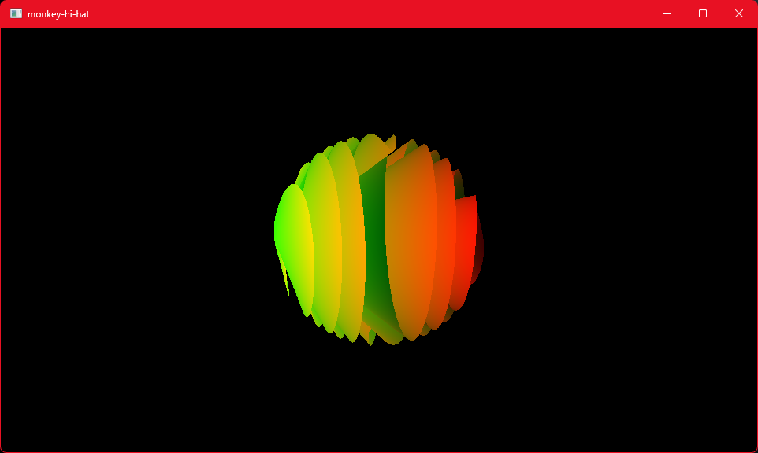

# Using Monkey Hi Hat

## Running for the First Time

The _Commands and Keys_ documentation shows you all of the command-line options, but that can be overwhelming at first. Here's a quick step-by-step. This assumes you are also using the visualizer and FX content from Volt's Laboratory, which the installer will automatically download and configure.

* Windows: Launch the program with the _Monkey Hi Hat_ icon from your Start Menu or Desktop
* Linux: Run the `mhh` program in the app directory under your home directory (ie. `cd ~/monkeyhihat; ./mhh`)
* You should see a spinning swirly-ball thing -- this is the "idle" shader built into the program:

If your program is running full-screen, press the <kbd>Spacebar</kbd> to switch to windowed mode. The program hides the mouse pointer by default, but the graphical output (not the terminal) must have focus for this to work. Now let's verify you can load the visualizers that were installed with the program.

With the idle shader still running:

#### Windows
* Launch a console window with the _Monkey Hi Hat Console_ icon from your Start Menu or Desktop
* The console window automatically shows the command-line help; view this any time by running `mhh --help`
* Execute the command `mhh --load warp_speed` ... you should see a "flying through space" visualizer start
* Try applying an effect, execute the command `mhh --load warp_speed rainbow_borders` for a more colorful version
* Finally, start some music and try the playlist command: `mhh --playlist variety`

#### Linux
* Open a terminal window and change to the app directory: `cd ~/monkeyhihat`
* To view help at any time, enter the command `./mhh --help`
* Execute the command `./mhh --load warp_speed` ... you should see a "flying through space" visualizer start
* Try applying an effect, execute the command `./mhh --load warp_speed rainbow_borders` for a more colorful version
* Finally, start some music and try the playlist command: `./mhh --playlist variety`

If any of these fail to load, check the console window for error messages, or view the `mhh.log` file in the app directory.

At this point the program is running in a window. You can resize or maximize that window, but you probably want to open the `mhh.conf` configuration file and change the `StartFullScreen` setting to `true`. But then, unless you have multiple monitors, it won't be easy to use a local terminal to send commands, and if you're running it remotely (for example, in your AV stack outputting to your TV), you don't want to be chained to the keyboard.

This is where remote control comes into play.

## Remote Control: Monkey-Droid GUI

Users with an Android or Windows device (even if Monkey Hi Hat itself runs on Linux) can install [Monkey Droid](https://github.com/MV10/monkey-droid), a simple dedicated GUI application for controlling Monkey Hi Hat running on another computer on the same local network. The Windows `msix` or the Android `apk` install packages are available on the [release](https://github.com/MV10/monkey-hi-hat/releases/) page. The Monkey Droid application has minor UI bugs (thanks to .NET 7's MAUI being released prematurely) but I plan to rewrite it in 2026 when the libraries have matured.

There is a setting which controls how these programs communicate. If you don't understand terms like TCP and port, just leave them at the defaults, it will almost always work. The Monkey Hi Hat `mhh.conf` config file has an `UnsecuredPort` setting, which is the TCP port where Monkey Hi Hat receives remote commands. By default, port 50001 will be used, but you can use any open port you wish. The official TCP custom or "dynamic" port range is 49152 to 65535, which is your safest bet for avoiding collisions with other things running on your system.

Start Monkey Hi Hat, then launch Monkey Droid on the device of your choosing. Tap the <kbd>+</kbd> "Add" icon at the top right of the Server List page. Enter the name of the computer where Monkey Hi Hat is running, enter the port number, and tap the `Save` button. After returning to the Server List page, choose the server you just defined, and choose the `Use` option from the pop-up. (You can also try the `Test` option just to verify network connectivity.)

Once a server is selected, you'll be sent to the Playlist page. It's initially empty, so ask the server what playlists are available: Tap the <kbd>&olarr;</kbd> "Refresh" icon at the top right of the page. If you're using the content provided in the [Volts Laboratory](https://github.com/MV10/volts-laboratory) repo, you'll see at least one playlist named `variety`. Select that and Monkey Hi Hat will load and use that playlist.

The Visualizer tab works similarly. It's initially empty, so tap the <kbd>&olarr;</kbd> "Refresh" icon at the top right. You can use this page to jump to any specific visualizer (shader). Note this will terminate the playlist, if one is active. Initially each entry will not have a description loaded. A background thread will read visualizer descriptions and whether or not they are audio-reactive (indicated by a music note icon).

The other tabs are self-explanatory. You can issue the other standard Monkey Hi Hat commands, or issue commands manually (which is useful for Monkey Hi Hat commands that haven't been added to Monkey Droid yet).

## Remote Control: SSH Terminal

Although the Monkey-Droid app is the most convenient option for normal use, it doesn't expose everything that Monkey Hi Hat can do. There is a manual-input area under _Utils_ but honestly the implementation isn't great. For full control, typing commands is the best option, although I will say 99% of the time I don't use anything but Monkey-Droid.

SSH (Secure Shell) is a remote terminal protocol, which is techno-nerd-speak that means you can type commands on a separate computer as if you were typing them directly into another computer. SSH has been used in the UNIX world for ages. Relatively recently, Microsoft finally got with the program and began shipping an SSH server and client, although they require a few extra steps to make them easier to use.

The computer running Monkey Hi Hat will act as the SSH server. The remote system where you actually enter commands will act as the SSH client. The client is usually just a command-line program that you run from the OS console (typically Terminal on Linux, or the modern Windows Terminal, or the Windows `cmd` command prompt). There are also third-party programs available for users who want to manage multiple servers or want more control over their sessions. For Windows, [PuTTY](https://putty.org/index.html) is a popular and free option.

### Enable Windows SSH Support

> Important: The instructions below create a relatively _insecure_ SSH setup. I trust everything _inside_ my network, so I'm not concerned about this, but that's your decision and I accept no responsibility if Evil Chinese Hax0rs gain access to your secret hoard of hipster coffee blends or whatever else is on your network. Secured key-based configuration is beyond the scope of this quick-start. Put on your big-boy pants and search the Interwebs, it's actually pretty easy to do.

The first step is to tell Windows you want to use OpenSSH Server and OpenSSH Client. From the Start menu, open _Settings_, click on _Apps_, click on _Optional Features_, and if you see _OpenSSH Server_ and _OpenSSH Client_ in this list, they're already installed and you're done. Otherwise, click (Win10) _Add a feature_ , or (Win11) click the _View features_ button on the _Add an optional feature_ line. Choose the checkbox next to _OpenSSH Server_ and/or _OpenSSH Client_, then click the (Win10) _Install_ button, or (Win11) click the _Next_ button then the _Install_ button. The installer will take a minute or two to download and install the apps.

The next step is to make sure OpenSSH Server is always running. Open the Start menu and type _Services_ and you should see the Services app show up. Click on it, then scroll down to find _OpenSSH SSH Server_. At the right, you'll probably see that startup mode is _Manual_ and nothing in the status column, indicating it is not running. Double-click on it, and in the properties dialog, change _Startup type_ to _Automatic_ or _Automatic (Delayed Start)_ (which lets Windows start more quickly), and under _Service status_ click on the _Start_ button, then click _Ok_ and close the Services app.

Finally, you need to open port 22 on your computer's firewall so that it can receive SSH traffic. Open the Start menu and type "Firewall" and you should see _Firewall & network protection_ pop up. Click on it, then click _Advanced settings_, which opens a Windows Defender dialog. Click _Inbound Rules_ at the top left, then _New Rule_ at the top right. The New Rule Wizard dialog opens. Click the _Port_ option, then click the _Next_ button. Keep the default _TCP_ and _Specific local ports_ options, and type _22_ in the field next to _Specific local ports_, then click the _Next_ button. Keep the default _Allow the connection_ setting and click _Next_ again. For Monkey Hi Hat purposes, you most likely only want OpenSSH to respond on _Private_ networks, so uncheck _Domain_ and uncheck _Public_ unless you intend to configure secure access. Finally, click _Next_ again, enter _OpenSSH Server_ as the firewall rule name, and click _Finish_. You can close the Windows Defender and Settings windows.

### Linux SSH Support

Typically if your distro doesn't already include OpenSSH, you merely request it from your packaging system.

Linux normally supports the SSH client app out of the box.

### Android SSH Client

I sometimes run [ConnectBot](https://play.google.com/store/apps/details?id=org.connectbot) on my Android phone. It's a little bit buggy, but it's free, it's actively maintained, and it doesn't harass you with bullshit ads that you'll never intentionally click.

### Using an SSH Client

Although the idea is to run the SSH client from another computer, you can test it locally on the same computer where Monkey Hi Hat and the SSH server is running. The client works the same way locally or remotely.

Open a terminal window and type `ssh user@computer` and press <kbd>Enter</kbd>. (Note that you may need to add `.local` to the computer name on some networks, particularly if either or both of the computers are running Linux.)

The first time you connect to a given SSH server, the client will warn you that it can't positively identify the server and ask you if you wish to proceed. This looks and works differently with different clients. With the OpenSSH Client on Windows, you'll have to type the word _yes_ to proceed. Other clients may show a dialog, or prompt for the <kbd>Y</kbd> key, or present a menu.

You are logging into the Monkey Hi Hat computer, so you'll be prompted for a password. SSH _always_ requires a password-protected account. Linux accounts normally always have a password, but on Windows you may have to alter your user login to accept a password, particularly if you're using a "Microsoft account" and/or the Windows Hello PIN, rather than a simple local account. These steps are beyond the scope of this Quick Start, but it's pretty easy to find more details online.

At that point you'll find yourself at a terminal prompt. From there you can issue all the usual `mhh` commands. The responses you see in your SSH client session is output from the other computer where Monkey Hi Hat is running: remote control via keyboard.

## Next Steps

Visit these pages:

* [Post-Install Instructions](https://www.monkeyhihat.com/docs/index.php#/post-install-instructions) describes some commonly-used settings.
* [Commands and Keys](https://www.monkeyhihat.com/docs/index.php#/commands-and-keys) is a complete reference to commands for the running program.
